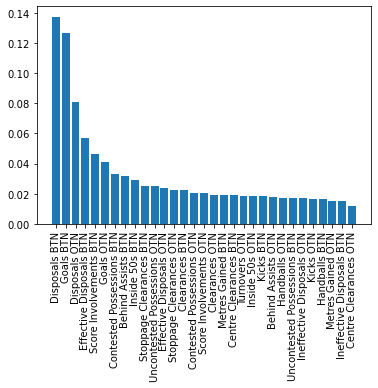
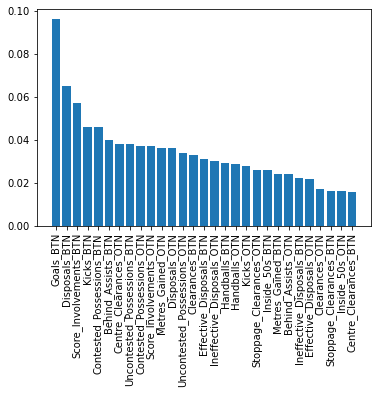
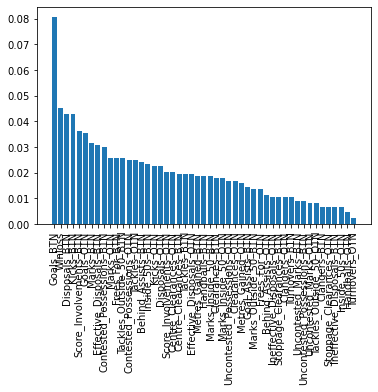

# Model for Predicting Brownlow Medal Winner (Using more than Linear Regression)
- Author: Lang (Ron) Chen
- Date: Dec 2022 - Feb 2023

**Presentables**
- Flask web application at `./app/Programme.py`
- To run web application, please open terminal at `./app` and input `export FLASK_APP='Programme.py'` and `flask run` before heading to the link as described printed in the terminal
- First click **scrape data** (may take a moment), followed by **predict**
- You can view game by game prediction by clicking **Game by Game Prediction**

**Introduction**

This project attempts to predict the Brownlow Medal winner (AFL's highest individual honour) based on statistics of each AFL game.
It predicts following the structure of the actual brownlow medal (i.e. voting game by game)

**Method**
1. Data was crawled and scraped from the afltables, and validated by footywire data; data were then stored by game
2. Additional features were generated
3. Features were normalised (x-mean)/sd within each game - with normalisation performed both with respect to only their team and the players on both teams.
4. Brownlow votes were turned into three labels using one hot encoding (i.e. 1 vote model: player with 1 vote has label 1, every other player 0; 2 vote model: player with 2 votes has label 2, every other player 0 etc); thus three final models were required
5. For each model, features that had abs(correlation with label) higher than 0.1 were selected
6. Many regression models were attempted (tuned to best validation score hyperparameter combination)

-  *models attempted includes: Linear Regression (with regularisation), Binomial Regression, K-Nearest Neighbour Regressor, Random Forest Regressor, AdaBoost Regressor, GradientBoost Regressor, XGB Regressor, LightGBM Regressor, CatBoost Regressor, Explainable Boosting Machine Regressor, Fully Connected Neural Network Regressor* 

Prediction

7. Each game was put through the three models to get predicted outputs. 
- the player with highest predicted score for 3-votes model gets 3 predicted votes
- the player with highest predicted score for 2-votes model gets 2 predicted votes, unless they have already received 3 votes in which case the second ranked player for this model gets 2 votes
- the player with highest predicted score for 1-votes model gets 1 predicted votes, unless they have already received 3 votes or 2 votes in which case the second ranked player for this model gets 1 vote. If the second ranked player also has received a higher vote then the third ranked player receives 1 vote
8. Each game's votes are tallied up and the player with the highest vote for the season is the predicted Brownlow Winner
 

**Tuning Results (Validation dataset r2 score)**
| Model | 1      | 2      | 3      |
|-------|--------|--------|--------|
| KNN   | 0.3996 | 0.0926 | 0.1103 |
| RFR   | 0.4889 | 0.0977 | 0.1279 |
| ADA   | 0.4010 | 0.0813 | 0.1108 |
| GBR   | 0.4972 | 0.0971 | 0.1286 |
| XGB   | 0.4958 | 0.0891 | 0.1229 |
| LGB   | 0.4980 |<ins>0.0982</ins> | 0.1257 |
| CBR   | 0.4674 | 0.0903 | 0.1228 |
| EBR   | 0.4591 | 0.0890 | 0.1204 |
| NN    | <ins>0.4985</ins> | 0.0907 | <ins>0.1326</ins> |

However, due to inability to replicate NN results, the ultimate models used were
- 1 vote: LightGB
- 2 votes: LightGB
- 3 votes: GradientBoost

**Results**

For held out 2022 data, predicted Clayton Oliver with 35 votes and actual winner Patrick Cripps on 28 votes (2nd). 

Emperically, model tends to have each year's actual winner within its top 3

**Interpretation and feature importance**

Model for 3 votes:

We can see quite clearly that players with high "disposals“ and ”goals“ (within both teams - as denoted by 'BTN' features which stand for Both-Team Normalisation) are most likely to get 3 votes in a game, as their features are most important. ”Effective disposals“ and “score involvement” are also prominant, while "contested possessions", "inside 50s" and "stoppage clearance" are also notable important features. This goes to suggest that ball-winning midfielders who can hit the scoreboard/get involved with scoring are most favoured by umpires (who casts the votes). The fact that "score involvement" and "effective disposals" are ranked highly in feature importance goes against the myth that Brownlow Medals are given to those that just has high disposals but don't use it effectively.

Model for 2 votes:

For 2-vote getters, "goals scored" are the most important factor, then "disposals" and "score involvements". "Contested possessions", "score involvements" and "centre clearances" still play a big part in determining whether a player is likely to receive 2 votes.

Model for 1 vote:

For 1-vote getters, "goals scored" seems to be the overarching important feature followed by a host of others, including "marks". This suggest 1 vote getters to be more general in characteristics compared to the previous two class of award winners.

"Marks" nonetheless was a significant aspect of the game not to feature prominently in the model, suggesting defenders to be worst biased against by umpires when casting Brownlow Medal votes, as this is a statistic that defenders generally excel at. As were tackles, which only featured highly in the 1 vote model, demonstrating that the medal is not as favoured towards pure inside-midfielders that do the dirty work as opposed to those that touches the ball more. The model suggests "win-loss" to have no effect on the 3 votes or 2 votes as it was not selected at all in those models.

**Bibliography**

Data Source

- AFLTables.com. 2022. Brownlow Votes Round by Round. [online] Available at: <https://afltables.com/afl/brownlow/brownlow_idx.html> [Accessed 26 January 2022].

- Footywire.com. 2022. AFL Fixture. [online] Available at: <https://www.footywire.com/afl/footy/ft_match_list> [Accessed 26 January 2022].
